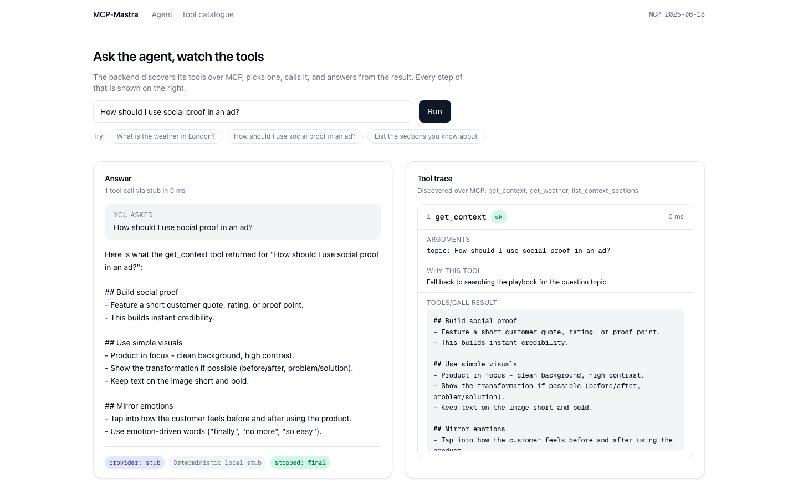
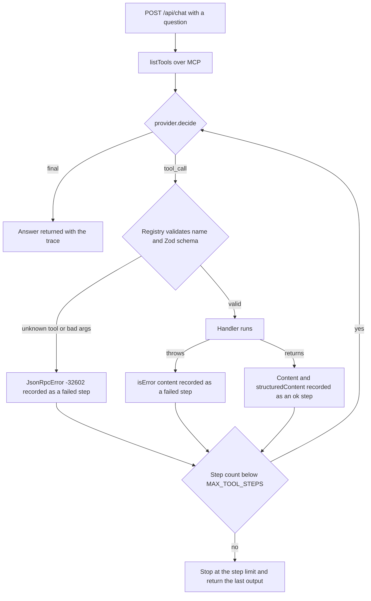
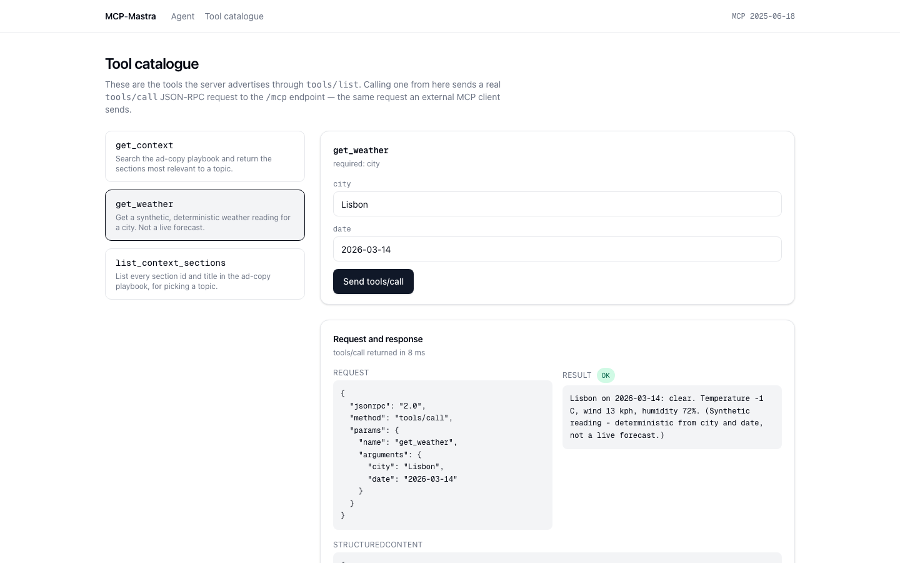
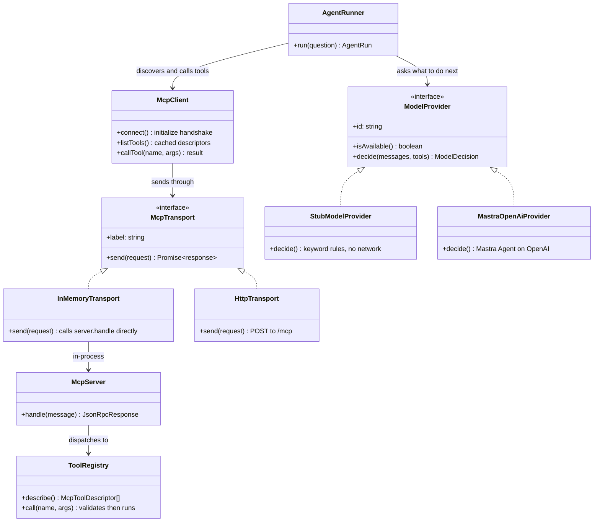

# MCP-Mastra

A small Model Context Protocol server, an agent loop that consumes it, and a web
console that shows you which tool the agent picked and what came back.



The interesting part of an agent is the bit you normally cannot see: which tool
it chose, what arguments it sent, whether the schema accepted them, and what came
back. All of that is a first-class response field here (`steps`), rendered in the
right-hand column, and asserted in tests.

**It runs with no API key.** The default model provider is a deterministic local
stub — a rule table that reads the question, picks a registered tool and writes
the answer out of the tool's output. Nothing in the default path touches a
network, which is what makes the screenshots reproducible, the suite non-flaky
and a fresh clone useful in one command. A real OpenAI model behind a Mastra
agent is one environment variable away, around the same loop.

## What actually happens when you ask a question



Three things in that picture are deliberate and are the parts worth reading the
code for:

- **The API has no privileged access to its own tools.** It reaches them through
  `McpClient` over a transport, exactly as an outside client would — the
  transport simply happens to be in-process.
- **A bad tool choice is data, not an exception.** An unknown name or an argument
  that fails its Zod schema is recorded as a failed step and appended to the
  transcript, so the next decision can correct it. Only the step cap ends the
  loop early.
- **A tool that throws is not a protocol error.** It returns content with
  `isError: true`, which is what lets a model read the failure. Getting that
  backwards is the most common way to break an MCP integration.

## The three tools the server advertises

| Tool | Arguments | What it returns |
|---|---|---|
| `get_context` | `topic` (string), `limit` (1-3, optional) | The playbook sections that best match the topic, ranked by keyword, title and body hits |
| `list_context_sections` | none | The id and title of all 7 playbook sections |
| `get_weather` | `city` (string), `date` (`YYYY-MM-DD`, optional) | A synthetic weather reading derived from an FNV-1a hash of city and date |

`get_weather` is honest in its own description — *"Get a synthetic,
deterministic weather reading for a city. Not a live forecast."* — because that
description is what a model reads when judging whether the tool fits. The hash
makes it reproducible without a key: same city and date, same reading; different
cities, different readings. That is exactly what a tool-calling test needs.

The playbook is seven sections of ad-copy advice in
`Backend/src/mcp/tools/playbook.ts`, a literal in source because the demo is
about the protocol rather than storage.

## Talking to the server as an MCP client

Two transports carry the same `McpServer` instance.

**Over HTTP**, one JSON-RPC message per POST to `/mcp`:

```bash
curl -s -X POST http://localhost:7271/mcp \
  -H 'Content-Type: application/json' \
  -d '{"jsonrpc":"2.0","id":1,"method":"tools/list"}'
```

**Over stdio**, newline-delimited JSON, which is how a desktop MCP client
launches a server as a subprocess:

```bash
cd Backend && npm run mcp:stdio
```

A real exchange on that transport, copied from a run:

```
--> {"jsonrpc":"2.0","id":1,"method":"initialize","params":{"protocolVersion":"2025-06-18","capabilities":{},"clientInfo":{"name":"demo","version":"1"}}}
<-- {"jsonrpc":"2.0","id":1,"result":{"protocolVersion":"2025-06-18","capabilities":{"tools":{"listChanged":false}},"serverInfo":{"name":"mcp-mastra-tools","version":"1.0.0"}}}
--> {"jsonrpc":"2.0","id":2,"method":"tools/call","params":{"name":"get_weather","arguments":{"city":"Lisbon","date":"2026-03-14"}}}
<-- {"jsonrpc":"2.0","id":2,"result":{"content":[{"type":"text","text":"Lisbon on 2026-03-14: clear. Temperature -1 C, wind 13 kph, humidity 72%. (Synthetic reading - deterministic from city and date, not a live forecast.)"}],"structuredContent":{"city":"Lisbon","date":"2026-03-14","condition":"clear","temperatureC":-1,"windKph":13,"humidityPct":72,"synthetic":true}}}
```

The server implements `initialize`, `notifications/initialized`, `ping`,
`tools/list` and `tools/call`, negotiates revisions `2025-06-18` and
`2025-03-26`, advertises `tools.listChanged: false`, and never answers a
notification.



## Running it

Developed and tested on Node `v22.22.3`. Two terminals:

```bash
# terminal 1 - MCP server + HTTP API on 7271
cd Backend
cp .env.example .env      # optional; every value has a default
npm install
npm run dev

# terminal 2 - Next.js console on 7272
cd Frontend
npm install
npm run dev
```

Open <http://localhost:7272>. No key, no database, no external service. Check the
backend came up cleanly:

```bash
curl -s http://localhost:7271/healthz
```

```json
{"status":"ok","provider":"stub","providerLabel":"Deterministic local stub","protocolVersion":"2025-06-18",
 "tools":["get_context","get_weather","list_context_sections"],"maxToolSteps":4,"warnings":[]}
```

Both pages accept deep links, so a run is something you can paste into an issue:
`/?q=What+is+the+weather+in+London%3F` runs a question on load, and
`/tools?tool=get_weather&city=Lisbon` sends that exact `tools/call`.

## Swapping the stub for a real model

Set two variables in `Backend/.env`:

```bash
MODEL_PROVIDER=openai
OPENAI_API_KEY=sk-...
OPENAI_MODEL=gpt-4o-mini   # optional
```

`MastraOpenAiProvider` builds a Mastra `Agent` over the OpenAI model behind the
same one-method `ModelProvider` port the stub implements: given the transcript
and the tools discovered over MCP, return one decision. Tool selection stays in
this project's loop rather than the framework's tool runner, so the trace, the
step cap and the MCP calls behave identically under either provider.

Two notes from wiring this up against `@mastra/core` 0.18.0:

- The agent's `generate()` logs *"Deprecation NOTICE: Generate method will
  switch to use generateVNext implementation September 30th, 2025. Please use
  generateLegacy if you don't want to upgrade just yet."* and forwards to
  `generateLegacy()`. The provider calls `generateLegacy()` directly when it
  exists, pinning behaviour rather than inheriting the installed default.
- `@mastra/core` and `@ai-sdk/openai` are imported lazily, inside the provider.
  A clone with no key never loads them, so nothing in the default path can fail
  on a missing credential.

Selecting `openai` without a key does not crash the server. It logs a warning,
falls back to the stub, and reports that warning on `/healthz`.

## The seams



Two interfaces carry the design. `McpTransport` is why one server can be spoken
to in-process, over HTTP and over a pipe without knowing which. `ModelProvider`
is why the demo runs offline. `McpServer` owns no socket and no stream — it takes
a parsed object and returns one — which makes a protocol test a function call.

Adding a tool is one array entry in `Backend/src/mcp/tools/index.ts`; it then
appears in `tools/list`, over both transports, in the agent's prompt and in the
console's catalogue, with no other edit.

## The HTTP surface

| Method | Path | Purpose |
|---|---|---|
| `GET` | `/healthz` | Provider, protocol version, tool names, step cap, config warnings |
| `GET` | `/api/tools` | The MCP catalogue, fetched through the client like any consumer |
| `POST` | `/api/chat` | `{ question }` in, an `AgentRun` with `answer` and `steps` out |
| `POST` | `/mcp` | Raw JSON-RPC. `202` with an empty body for notifications |

Errors share one JSON shape (`{ error, details? }`), stack traces never leave the
process, questions cap at 2000 characters and bodies at 64kb, and CORS is an
allow-list via `CORS_ORIGINS` rather than a bare `cors()`.

## Tests

```bash
cd Backend  && npm test    # 97 passed (10 files)
cd Frontend && npm test    #  9 passed (1 file)
```

The backend suite covers the JSON-RPC envelope, registry validation and name
rules, both context tools and the weather hash, every server method including
malformed envelopes and notifications, client handshake memoisation and tool-list
caching, the stub's routing rules, loop control flow (step limit, unknown tool,
schema violation, no-tool answer), config and provider selection, and the HTTP
API end to end through supertest. The frontend suite covers the formatting
helpers in `src/lib/api.ts`.

`npm run lint` and `npm run typecheck` pass clean in both packages (ESLint flat
config with `typescript-eslint` in the backend, `eslint-config-next` in the
frontend, Prettier for formatting).

## Docker

```bash
docker compose up --build
```

Both images are multi-stage and run as the unprivileged `node` user; the backend
copies only `dist/` and a production `node_modules` into its runtime stage. The
frontend takes `NEXT_PUBLIC_API_BASE` as a build argument because Next.js inlines
it at build time, not at `docker run`. The backend has a `/healthz` healthcheck
and the frontend waits for it.

**`docker compose config` parses, but the images have not been built or booted** —
Docker was unavailable where this was last verified, so treat the native path
above as the tested one.

## Where the code lives

```
Backend/src/
  config.ts              Every env var, read and validated once
  container.ts           Composition root: registry -> server -> client -> runner
  index.ts / stdio.ts    Bootstrap for HTTP, and for a stdio MCP subprocess
  mcp/
    protocol.ts          JSON-RPC envelope + MCP types and error codes
    registry.ts          Zod-schema'd tools, validation, JSON Schema generation
    server.ts            Method dispatch and version negotiation
    client.ts            Handshake, tool cache, failure-to-exception mapping
    transport/           inMemory | http | stdio
    tools/               get_context, list_context_sections, get_weather
  agent/
    provider.ts          The ModelProvider port
    providers/           stub (default) | mastraOpenAi (needs a key)
    loop.ts              Discover, decide, call, record, repeat
  http/                  Express app, routes, error shape
Frontend/src/
  app/page.tsx           Agent console: answer + tool trace
  app/tools/page.tsx     Tool catalogue and JSON-RPC playground
  lib/                   Typed API client, response types, config
```

## Known limits

- **The default provider is not a model.** It is a keyword rule table: it routes
  "weather in London" to `get_weather` and almost everything else to
  `get_context`, does not reason, and will not chain two tools. The UI labels
  every run with the provider that produced it.
- **The OpenAI path has not been exercised here.** It is written against
  `@mastra/core` 0.18.0 and type-checks, but no run in this repository has used a
  real key, so treat it as untested.
- **The MCP implementation is a subset.** Tools only: no resources, no prompts,
  no sampling, no `listChanged` notifications, no SSE or session resumption, and
  `tools/list` returns every tool in one page rather than paginating.
- **`/mcp` is unauthenticated** and shares one server instance across callers —
  fine for a local demo, not a deployment posture. The weather data is synthetic
  and the playbook is seven hard-coded sections; neither is a real data source.
